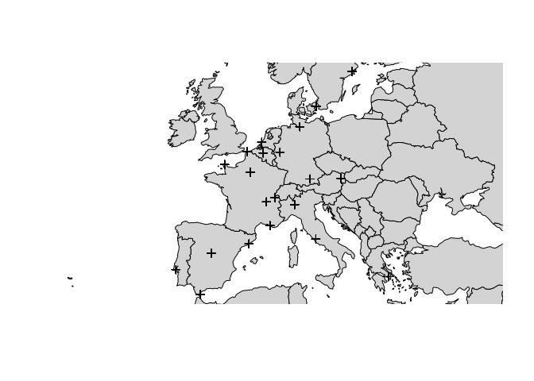

<!-- README.md is generated from README.Rmd. Please edit that file -->
geonetwork
==========

Classes and methods for handling networks or graphs whose nodes are geographical (i.e. locations in the globe). Create, transform, plot.

Installation
------------

<!-- You can install the released version of geonetwork from [CRAN](https://CRAN.R-project.org) with: -->
<!-- ``` r -->
<!-- install.packages("geonetwork") -->
<!-- ``` -->
`geonetwork` is in development. You can install the current version from GitHub with:

``` r
remotes::install_github("famuvie/geonetwork")
```

Example
-------

### Creation

A `geonetwork` is an object of class `igraph` whose nodes have *geospatial* attributes (i.e. coordinates and CRS).

Consider the distances (in km) between 21 cities in Europe from the `datasets` package. A simple way of constructing a `geonetwork` is by combining a data.frame of `nodes` with one of `edges`:

``` r
cities <- cbind(
  city = labels(datasets::eurodist),
  ggmap::geocode(labels(datasets::eurodist), source = "dsk")
)

## ggmap can either use Google Maps Api (which requires registration
## with credit card and offers limited amount of queries) of 
## Data Science Toolkit (DSK) whose service is being shut-down.
## 
## Alternatively, uses OpenStreetMap Nominatim service
# tmaptools::geocode_OSM(labels(datasets::eurodist))

distances <- 
  expand.grid(
    origin = labels(datasets::eurodist),
    destin = labels(datasets::eurodist),
    stringsAsFactors = FALSE,
    KEEP.OUT.ATTRS = FALSE
  )
distances <- 
  cbind(
    distances[distances$destin < distances$origin,],
    distance = as.numeric(datasets::eurodist)
  )

str(cities)
#> 'data.frame':    21 obs. of  3 variables:
#>  $ city: Factor w/ 21 levels "Athens","Barcelona",..: 1 2 3 4 5 6 7 8 9 10 ...
#>  $ lon : num  23.72 2.16 4.35 1.85 -1.62 ...
#>  $ lat : num  38 41.4 50.9 51 49.6 ...
str(distances)
#> 'data.frame':    210 obs. of  3 variables:
#>  $ origin  : chr  "Barcelona" "Brussels" "Calais" "Cherbourg" ...
#>  $ destin  : chr  "Athens" "Athens" "Athens" "Athens" ...
#>  $ distance: num  3313 2963 3175 3339 2762 ...

eurodist <- geonetwork(distances, nodes = cities, directed = FALSE)
```

Several assumptions were made here unless otherwise specified:

-   The first column in `cities` was matched with the first two columns in `distances`.

-   The second and third columns in `cities` were assumed to be longitude and latitude in decimal degrees in a WGS84 CRS.

-   The remaining column in `distances` was treated as an edge *weight*.

Now we can readily plot the network, optionally with some additional geographical layer for context:

``` r
## Base system
plot(eurodist, axes = TRUE, type = "n")
plot(sf::st_geometry(spData::world), col = "lightgray", add = TRUE)
plot(eurodist, axes = TRUE, add = TRUE)
```



``` r

# bgm <- ggmap::get_stamenmap(bbox = unname(sf::st_bbox(eurodist)),
# zoom = 5, maptype = "watercolor") plot(st_transform(eurodist, 3857),
# bgMap = bgm)

## tmap

## mapview

## ggplot2

# library(ggplot2)
# ggplot() +
#   geom_sf(eurod_net_dummy) +
#   geom_sf(spData::world)
```
